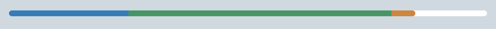

# react-multi-progress



A simple, typed react progress bar that allowes multiple layers in different colors. [Demo](http://progress.bitter.li)

## Installation

Install with npm:

- `npm install react-multi-progress --save`

You can now import `react-multi-progress` as a normal package installed from npm like so:

```
import MultiProgress from 'react-multi-progress'
...
```

You can also import the type definitions if you're using TypeScript like so:

```
import MultiProgress, { IMultiProgressProps } from 'react-multi-progress'
...
```

## Available props

| Attribute        |        Type         | Optional |  Default  | Description                                                                                |
| :--------------- | :-----------------: | :------: | :-------: | ------------------------------------------------------------------------------------------ |
| backgroundColor  |      `string`       |   yes    | `#ffffff` | Background color of the progress bar                                                       |
| border           |      `string`       |   yes    |  `none`   | set a border around the progress bar, e.g. `1px solid red`                                 |
| elements         | `ProgressElement[]` |    no    |  `none`   | Set the color and size of each element, see "ProgressElement" below.                       |
| height           |      `number`       |   yes    |   `10`    | Height of the progress bar in `px`                                                         |
| round            |       `bool`        |   yes    |  `true`   | Wheter the ends of the progress bar container should be rounded                            |
| roundLastElement |       `bool`        |   yes    |  `true`   | Wheter the last progress element should be rounded on the right end                        |
| transitionTime   |      `number`       |   yes    |   `0.6`   | Transition time in seconds to animate when the value changes. Set to `0` for no animation. |

### ProgressElement

| Attribute |   Type   | Optional | Description                                      |
| :-------- | :------: | :------: | :----------------------------------------------- |
| value     | `number` |    no    | Length of the element in % (0-100)               |
| color     | `string` |    no    | Color of the element (any css compatible format) |

## Example

### Basic

```jsx
import MultiProgress from "react-multi-progress";

function Progress() {
	return (
		<MultiProgress
			elements={[
				{
					value: 35,
					color: "blue",
				},
			]}
		/>
	);
}
```

### Advanced

```jsx
import MultiProgress from "react-multi-progress";

function Progress() {
	return (
		<MultiProgress
			transitionTime={1.2}
			elements={[
				{
					value: 15,
					color: "blue",
				},
				{
					value: 35,
					color: "rgb(100,0,0)",
				},
				{
					value: 25,
					color: "#acf",
				},
			]}
			height={25}
			backgroundColor="gray"
			border={"1px solid red"}
		/>
	);
}
```
